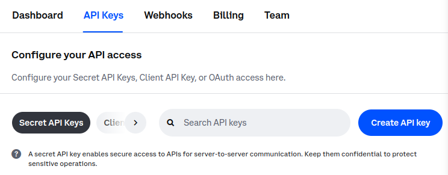

# Develop with Coinbase: Getting Started

## Introduction

This guide will guide you through getting started with Coinbase development.

<!-- For the sake of brevity, I'm only covering the CDP Python setup here -->

# Prerequisites

- Python 3.10 or higher
- An existing [Coinbase Developer Platform account](https://login.coinbase.com/signup)

## Step 1 -- Select an SDK to install

### Backend: CDP SDK
Use the Coinbase Developer Platform (CDP) SDK to store, send, trade, and stake your assets.

The CDP SDK currently supports Typescript and Ruby.
#### Usage
- Create your own secure MPC wallets 
- Access onchain data, a Base Sepotia faucet, and transfer USDC for free
- Leverage crypto functions (transfer, stake, or trade)
- Use Webhooks to receive real-time onchain notifications

#### Installation

Install the CDP SDK using `pip`:

```
pip install cdp-sdk
```

### Frontend: Onchain Kit

Build onchain apps with ready-to-use React components and Typescript utilities. 

#### Usage
- Create or connect your wallet with [Smart Wallet](https://www.smartwallet.dev)
- Sponsor onchain transactions with [Paymaster](https://www.coinbase.com/developer-platform/products/paymaster)
- Swap tokens using the [Swap components](https://onchainkit.xyz/swap/swap)
- Display [Basenames](https://www.base.org/names) and [ENS avatars](https://docs.ens.domains/web/avatars), names, and addresses

#### Installation
<!-- install instructions -->
(I only covered CDP SDK for python) 

## Step 2 -- Create a CDP API key

Assuming you are already signed in, create an API key from the [CDP portal](https://portal.cdp.coinbase.com/projects/api-keys).

Click the **Create API key** button under the **API Keys** tab:



Give the key a name. Under **API-specific restrictions** check **View**, **Trade**, and **Transfer**.

Once complete, click **Create & download** to create the API key.

## What to read next

- **[CDP SDK: Create a wallet and transact funds](backend-create-wallet.md):** Create a wallet and send onchain funds in minutes
